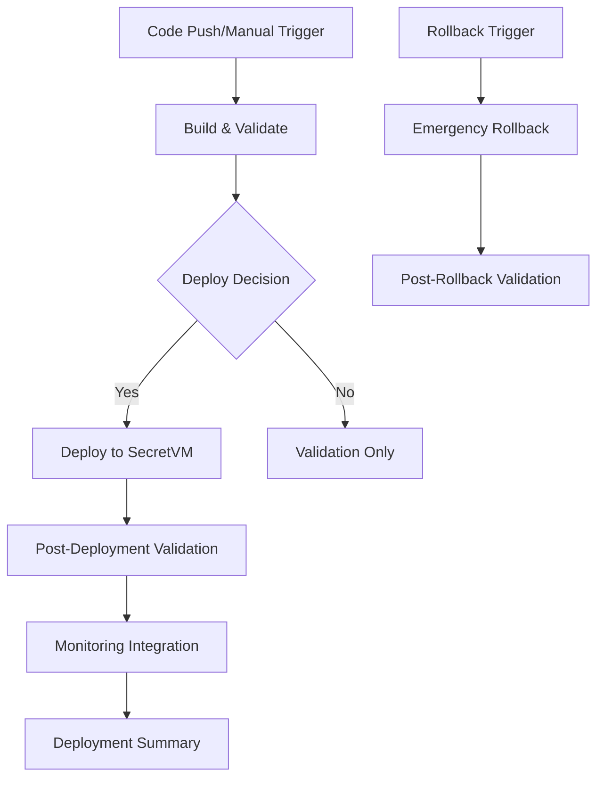

# CI/CD Documentation - attest_ai

Complete documentation for GitHub Actions CI/CD pipeline integrating with Phase 4 SecretVM deployment infrastructure.

## Table of Contents

1. [Overview](#overview)
2. [Pipeline Architecture](#pipeline-architecture)
3. [Workflow Configuration](#workflow-configuration)
4. [Deployment Process](#deployment-process)
5. [Monitoring & Management](#monitoring--management)
6. [Rollback Procedures](#rollback-procedures)
7. [Security & Compliance](#security--compliance)
8. [Troubleshooting](#troubleshooting)

---

## Overview

### CI/CD Pipeline Goals

The attest_ai CI/CD pipeline provides:

✅ **Automated Deployment**: Commit-to-production pipeline  
✅ **Comprehensive Validation**: Multi-stage testing and verification  
✅ **Security Integration**: Secure credential management  
✅ **Monitoring Integration**: Real-time deployment feedback  
✅ **Rollback Capability**: Emergency recovery procedures  
✅ **Audit Trail**: Complete deployment history  

### Integration with Phase 4 Infrastructure

The CI/CD pipeline leverages all Phase 4 components:

| Phase 4 Component | CI/CD Integration |
|------------------|-------------------|
| `scripts/deploy_secretvm.sh` | Core deployment automation |
| `scripts/test_secretvm_deployment.py` | SecretVM validation |
| `scripts/health_validator.py` | Health validation |
| `scripts/post_deployment_test_suite.py` | Comprehensive testing |
| `scripts/monitor_secretvm_deployment.py` | Monitoring integration |
| Environment detection system | Optimization and reporting |

---

## Pipeline Architecture

### Workflow Structure



### Job Dependencies

```yaml
Jobs:
  1. build-and-validate (Always runs)
     ├── Code quality checks
     ├── Docker image build
     ├── Configuration validation
     └── Unit tests
     
  2. deploy-secretvm (Conditional)
     ├── Depends on: build-and-validate
     ├── SecretVM CLI setup
     ├── Environment preparation
     └── Deployment execution
     
  3. validate-deployment (Conditional)
     ├── Depends on: deploy-secretvm
     ├── Health validation
     ├── Functionality testing
     └── Performance baseline
     
  4. setup-monitoring (Conditional)
     ├── Depends on: validate-deployment
     ├── Monitoring configuration
     └── Dashboard setup
     
  5. deployment-summary (Always runs)
     ├── Depends on: All previous jobs
     ├── Artifact collection
     └── Report generation
```

---

## Workflow Configuration

### Trigger Configuration

#### Automatic Triggers

```yaml
# Push to main branch
on:
  push:
    branches: [main]
    paths-ignore: ['**.md', 'docs/**']
```

#### Manual Triggers

```yaml
# Manual deployment with parameters
workflow_dispatch:
  inputs:
    environment: [staging, production]
    validation_level: [quick, comprehensive, extended]
    force_deploy: boolean
    deploy_monitoring: boolean
```

#### Pull Request Validation

```yaml
# PR validation (no deployment)
pull_request:
  branches: [main]
  paths-ignore: ['**.md', 'docs/**']
```

### Environment Configuration

#### Staging Environment
- **Automatic deployment** on main branch push
- **Quick validation** by default
- **No manual approval** required

#### Production Environment
- **Manual trigger** required
- **Comprehensive validation** enforced
- **Manual approval** required (configured in GitHub)

---

## Deployment Process

### Step-by-Step Deployment

#### 1. Build & Validation Stage

```bash
# Automatic execution on trigger
Jobs: build-and-validate
├── Checkout code
├── Setup Python environment
├── Install dependencies
├── Code quality checks
│   ├── Secret scanning
│   ├── Syntax validation
│   └── Security scan
├── Docker image build
│   ├── Build with cache
│   ├── Test container start
│   └── Tag with commit SHA
├── Configuration validation
│   └── Test settings loading
├── Unit tests
│   └── Import and basic functionality
└── Deployment decision
    ├── Determine environment
    ├── Set validation level
    └── Approve/deny deployment
```

#### 2. SecretVM Deployment Stage

```bash
# Conditional execution based on triggers
Jobs: deploy-secretvm
├── Environment: staging/production
├── SecretVM CLI installation
├── Authentication setup
├── Production environment preparation
│   ├── Create .env.production
│   ├── Load GitHub Secrets
│   └── Validate configuration
├── Pre-deployment validation
│   ├── Check environment format
│   ├── Verify required secrets
│   └── Test configuration loading
├── Deploy to SecretVM
│   ├── Execute deploy_secretvm.sh
│   ├── Monitor deployment progress
│   └── Capture VM information
└── Store deployment artifacts
    ├── deployment-info.json
    ├── .vm_id file
    └── .vm_url file
```

#### 3. Post-Deployment Validation

```bash
# Validation level determined by input
Jobs: validate-deployment
├── Basic health check
│   ├── Wait for application ready
│   ├── Test health endpoint
│   └── Verify healthy status
├── SecretVM environment validation
│   └── Run test_secretvm_deployment.py
├── Comprehensive validation (optional)
│   └── Run health_validator.py --strict
├── Extended test suite (optional)
│   └── Run post_deployment_test_suite.py --extended
├── Performance baseline
│   ├── Test endpoint response times
│   ├── Measure key operations
│   └── Create performance report
└── Upload validation results
```

#### 4. Monitoring Integration

```bash
# Monitor setup and configuration
Jobs: setup-monitoring
├── Test monitoring endpoints
│   ├── /api/environment/info
│   ├── /api/environment/resources
│   └── /api/environment/health/detailed
├── Create monitoring dashboard
│   ├── Generate monitoring config
│   ├── Setup dashboard URLs
│   └── Configure management commands
└── Upload monitoring configuration
```

### Deployment Validation Criteria

#### Success Criteria

| Stage | Requirement | Pass Criteria |
|-------|-------------|---------------|
| **Build** | Code Quality | No secrets in code, syntax valid |
| **Build** | Docker Image | Container builds and starts |
| **Build** | Configuration | Settings load without errors |
| **Deploy** | VM Creation | SecretVM instance created successfully |
| **Deploy** | Environment Upload | Credentials uploaded and encrypted |
| **Deploy** | Application Start | Health endpoint responds within 5 minutes |
| **Validate** | Health Check | Status = "healthy" |
| **Validate** | SecretVM Detection | Confidence > 90% |
| **Validate** | Self-Attestation | Real attestation data available |

#### Failure Handling

```yaml
# Automatic failure responses
on_failure:
  build_stage:
    - Stop pipeline
    - Report build errors
    - No deployment attempted
    
  deploy_stage:
    - Capture deployment logs
    - Save VM information if created
    - Mark deployment as failed
    - Trigger cleanup if needed
    
  validate_stage:
    - Capture validation results
    - Mark deployment as degraded
    - Continue with monitoring setup
    - Alert team of issues
```

---

## Monitoring & Management

### Real-Time Monitoring Integration

#### Deployment Monitoring

The CI/CD pipeline integrates with Phase 4 monitoring tools:

```bash
# Automatic monitoring setup
1. Test monitoring endpoints during deployment
2. Create monitoring configuration file
3. Generate dashboard with key metrics
4. Setup management command shortcuts
```

#### Key Monitoring Endpoints

| Endpoint | Purpose | CI/CD Integration |
|----------|---------|-------------------|
| `/health` | Basic health check | Deployment validation |
| `/api/environment/info` | Environment detection | SecretVM verification |
| `/api/environment/resources` | Resource usage | Performance monitoring |
| `/api/environment/health/detailed` | Comprehensive health | Complete validation |

#### Performance Metrics

```bash
# Automated performance baseline
Metrics captured during deployment:
- Health endpoint response time
- Self-attestation response time  
- API endpoint availability
- Resource usage patterns
- SecretVM confidence score
```

### Management Commands

#### Post-Deployment Management

```bash
# Automatically generated in deployment summary
# VM Management
secretvm-cli vm status $VM_ID
secretvm-cli vm logs $VM_ID --tail 50
secretvm-cli vm restart $VM_ID

# Application Monitoring  
python3 scripts/monitor_secretvm_deployment.py --vm-url $VM_URL
python3 scripts/health_validator.py --vm-url $VM_URL --strict

# Resource Monitoring
curl $VM_URL:8000/api/environment/resources
curl $VM_URL:8000/api/environment/health/detailed
```

---

## Rollback Procedures

### Emergency Rollback Workflow

#### Automatic Rollback Triggers

```yaml
# rollback-deployment.yml workflow
Triggers:
  - Manual dispatch only (no automatic rollback)
  - Requires VM ID and rollback reason
  - Optional previous VM ID for restoration
```

#### Rollback Process

```bash
# Step-by-step rollback procedure
1. Validate Rollback Request
   ├── Check VM exists and status
   ├── Verify rollback permissions
   └── Assess previous VM availability

2. Capture Pre-Rollback State  
   ├── VM status and configuration
   ├── Application logs
   ├── Health check results
   └── Resource usage data

3. Execute Rollback
   ├── Stop failed VM
   ├── Restore previous VM (if available)
   ├── OR deploy emergency replacement
   └── Cleanup failed VM (optional)

4. Validate Rollback Success
   ├── Test VM status
   ├── Verify application health
   ├── Check self-attestation
   └── Confirm functionality

5. Post-Rollback Actions
   ├── Create rollback report
   ├── Upload investigation artifacts
   └── Notify team of completion
```

#### Rollback Decision Matrix

| Scenario | Action | Recovery Method |
|----------|--------|-----------------|
| **Previous VM Available** | Restore previous VM | Start previous VM, verify health |
| **No Previous VM** | Emergency deployment | Deploy new VM with same config |
| **VM Creation Failed** | Cleanup only | Delete failed VM, report error |
| **Application Failed** | Replace VM | Deploy new VM, cleanup old |

---

## Security & Compliance

### Credential Management

#### Required GitHub Secrets

```bash
# Production secrets (required)
SECRETVM_WALLET_ADDRESS    # SecretVM authentication
SECRET_AI_API_KEY         # Secret AI master key  
ARWEAVE_WALLET_JWK        # Arweave wallet (JWK format)

# Optional environment-specific secrets
SECRETVM_WALLET_ADDRESS_STAGING
SECRET_AI_API_KEY_STAGING
ARWEAVE_WALLET_JWK_STAGING
```

#### Security Best Practices

```yaml
Security Measures:
  credential_handling:
    - Secrets stored in GitHub Secrets only
    - No secrets in code or logs
    - Environment-specific secret separation
    - Regular secret rotation (90 days)
    
  access_control:
    - Branch protection rules enabled
    - Manual approval for production
    - Least privilege principle
    - Audit trail maintenance
    
  deployment_security:
    - SecretVM encrypted environment upload
    - No credential exposure in artifacts
    - Secure communication channels
    - VM isolation and protection
```

### Compliance Features

#### Audit Trail

```bash
# Complete deployment history
Audit Information Captured:
- Deployment timestamp and duration
- Triggering user and commit SHA
- Environment and validation level
- VM ID and deployment URL
- Validation results and performance metrics
- Success/failure status and error details
```

#### Documentation Requirements

```bash
# Automatically generated documentation
1. Deployment Summary (per deployment)
2. Monitoring Configuration (per VM)
3. Rollback Report (per rollback)
4. Performance Baseline (per deployment)
5. Validation Results (per test run)
```

---

## Troubleshooting

### Common CI/CD Issues

#### 1. Secret Configuration Problems

**Symptoms**:
- Authentication failures in SecretVM CLI
- Invalid API key errors in Secret AI
- JSON parsing errors in Arweave client

**Solutions**:
```bash
# Validate secrets locally before setting in GitHub
echo "$SECRET_AI_API_KEY" | base64 -d
echo "$ARWEAVE_WALLET_JWK" | jq '.'
echo "$SECRETVM_WALLET_ADDRESS" | grep -E '^secret1[a-z0-9]{38}$'

# Check secret configuration in GitHub Actions
- Verify secret names match exactly
- Ensure secrets are set at repository level
- Check environment-specific secrets if using
```

#### 2. Deployment Failures

**Symptoms**:
- VM creation fails
- Application doesn't start
- Health checks fail

**Debugging Steps**:
```bash
# Check deployment logs
1. Review GitHub Actions logs for deployment stage
2. Check SecretVM CLI output for errors
3. Examine application logs: secretvm-cli vm logs $VM_ID

# Validate environment
4. Test configuration loading locally
5. Verify Docker image builds correctly
6. Check network connectivity requirements
```

#### 3. Validation Failures

**Symptoms**:
- Health checks fail
- SecretVM detection fails
- Performance below threshold

**Resolution**:
```bash
# Manual validation
1. Run validation scripts manually:
   python3 scripts/test_secretvm_deployment.py --vm-url $VM_URL
   python3 scripts/health_validator.py --vm-url $VM_URL

2. Check specific issues:
   curl $VM_URL:8000/health
   curl $VM_URL:8000/api/attestation/self
   curl $VM_URL:8000/api/environment/info

3. Review validation level settings:
   - Use 'quick' for faster validation
   - Use 'comprehensive' for thorough testing
   - Use 'extended' for complete validation
```

### Debug Commands

#### CI/CD Pipeline Debugging

```bash
# Workflow debugging
1. Check workflow syntax:
   github-actions-runner validate .github/workflows/deploy-secretvm.yml

2. Test deployment locally:
   ./scripts/deploy_secretvm.sh

3. Validate secrets format:
   # Run secret validation workflow manually
   
4. Check environment detection:
   python3 -c "
   from src.utils.environment import EnvironmentDetector
   from src.config import get_settings
   # Test environment detection logic
   "
```

#### VM Investigation

```bash
# VM troubleshooting
1. Check VM status:
   secretvm-cli vm status $VM_ID --format json

2. Review VM logs:
   secretvm-cli vm logs $VM_ID --tail 100

3. Test network connectivity:
   secretvm-cli vm exec $VM_ID "curl localhost:8000/health"

4. Check resource usage:
   curl $VM_URL:8000/api/environment/resources
```

### Performance Optimization

#### CI/CD Pipeline Performance

```yaml
Optimization Strategies:
  build_stage:
    - Docker layer caching
    - Dependency caching
    - Parallel job execution
    
  deployment_stage:
    - Optimized VM sizing
    - Environment-specific settings
    - Monitoring integration
    
  validation_stage:
    - Configurable validation levels
    - Parallel test execution
    - Early failure detection
```

---

## Workflow Examples

### Example 1: Automatic Staging Deployment

```bash
# Trigger: Push to main branch
1. Developer pushes code to main
2. CI/CD automatically triggers
3. Build & validation passes
4. Deploys to staging environment
5. Runs comprehensive validation
6. Sets up monitoring
7. Generates deployment summary

Result: 
- New staging VM running latest code
- All validation tests pass
- Monitoring configured and active
- Team notified of successful deployment
```

### Example 2: Manual Production Deployment

```bash
# Trigger: Manual workflow dispatch
1. Team lead triggers production deployment
2. Selects 'production' environment
3. Chooses 'extended' validation level
4. Build & validation passes
5. Manual approval step (GitHub environment protection)
6. Deploys to production environment
7. Runs extended test suite
8. Sets up production monitoring
9. Creates comprehensive deployment report

Result:
- Production VM running validated code
- Extended test suite passes
- Production monitoring active
- Complete audit trail available
```

### Example 3: Emergency Rollback

```bash
# Trigger: Manual rollback workflow
1. Issue detected in production
2. Team initiates emergency rollback
3. Specifies VM ID and rollback reason
4. Previous VM restored automatically
5. Rollback validation passes
6. Team notified of successful rollback
7. Investigation artifacts preserved

Result:
- Previous stable version restored
- Downtime minimized
- Complete rollback audit trail
- Failed deployment artifacts preserved for analysis
```

---

## Best Practices

### Development Workflow

```bash
# Recommended development process
1. Feature Development
   ├── Create feature branch
   ├── Develop and test locally
   ├── Create pull request
   └── Review and merge to main

2. Staging Deployment
   ├── Automatic deployment on main merge
   ├── Comprehensive validation
   ├── Team testing and validation
   └── Performance verification

3. Production Deployment
   ├── Manual production deployment trigger
   ├── Extended validation suite
   ├── Manual approval process
   └── Production monitoring setup

4. Monitoring and Maintenance
   ├── Regular health monitoring
   ├── Performance trend analysis
   ├── Security audit compliance
   └── Incident response procedures
```

### CI/CD Maintenance

```bash
# Regular maintenance tasks
Weekly:
- Review deployment success rates
- Check performance trends
- Verify monitoring effectiveness
- Update dependencies if needed

Monthly:
- Rotate GitHub Secrets
- Review access permissions
- Update documentation
- Conduct rollback drills

Quarterly:
- Security audit of CI/CD pipeline
- Performance optimization review
- Disaster recovery testing
- Team training on procedures
```

---

## Integration Points

### Phase 4 Integration Summary

The CI/CD pipeline seamlessly integrates with all Phase 4 components:

| Phase 4 Component | CI/CD Integration | Benefit |
|------------------|-------------------|---------|
| **Deployment Automation** | Uses `deploy_secretvm.sh` as core | Proven deployment process |
| **Environment Detection** | Leverages detection system | Automatic optimization |
| **Validation Framework** | Integrates all test scripts | Comprehensive validation |
| **Monitoring Tools** | Connects with monitoring | Real-time feedback |
| **Documentation** | Uses existing procedures | Consistent processes |

### Future Enhancements

```bash
# Potential CI/CD improvements
1. Multi-environment support
   - Development, staging, production environments
   - Environment-specific configurations
   - Automated promotion pipelines

2. Advanced monitoring integration
   - Slack/email notifications
   - Performance alerting
   - Automated scaling triggers

3. Enhanced security features
   - Vulnerability scanning
   - Compliance reporting
   - Secret rotation automation

4. Performance optimizations
   - Parallel deployment strategies
   - Blue-green deployments
   - Canary releases
```

---

This comprehensive CI/CD documentation provides complete coverage of the GitHub Actions pipeline, integrating seamlessly with the Phase 4 SecretVM deployment infrastructure to create a production-ready automation system.